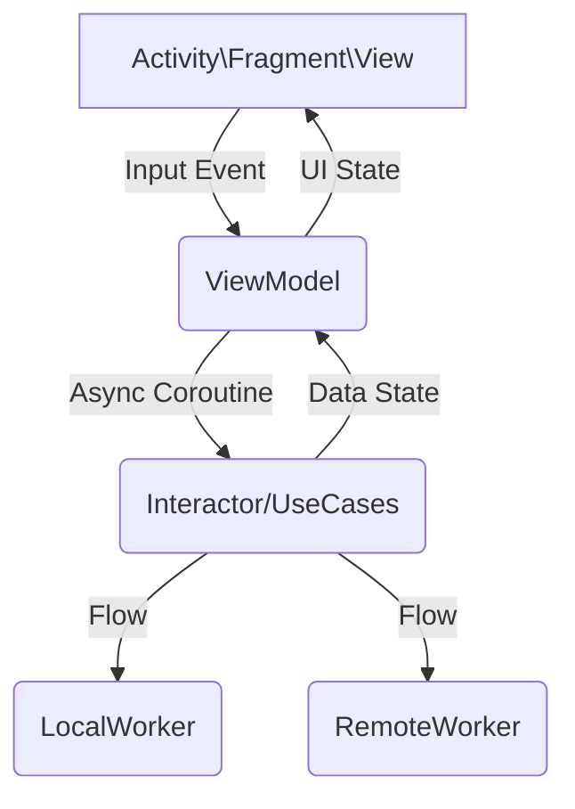

# Overview

The goal of the test is to create an app that shows information about countries around the world.
The app has to display a list of countries with their flags, you can open the detail screen by
selecting a country. The user can filter the list of countries by language and/or continent. The app
must be written in Kotlin and it must be build with minum API level 23.

# About of Project

The app has been completely in native Kotlin language, has a modular architecture based on the
interactor\use-case pattern. The data shown are taken from a free web service that makes available
the information of all the countries in the world (Restcountry.com)

## Technology stack

### Modular Application

A project with multiple Gradle modules is known as a multi-module project. Modularization is a
practice of organizing a codebase into loosely coupled and self contained parts. Each part is a
module. Each module is independent and serves a clear purpose.

1. android application (app module)
1. android-library-build.gradle
    - Android module that contains ui components.
1. library-build.gradle
    - Pure kotlin library.

### Shared Components

1. Ktor (Network Client)
1. SQL Delight (Caching Client)

### Android Specific Components

1. Jetpack Compose
1. Jetpack Compose Navigation
    - Single activity, nothing fragments
1. __Coil__
    - An image loading library for Android backed by Kotlin Coroutines.
1. __Accompanist__
    - A library which provides Compose Animation support for Jetpack Navigation Compose
1. __Hilt__
    - A library for Dependency injection
1. __ViewModel__
    - I decided to use ViewModel from Android Architecture because it gives so much state management
      stuff for free.
1. __Coroutine + Flow__
    - Management of asynchronous Task\Use-case
1. __Light&Dark Mode__

# Module Design

| Module name                                                            | Type            | Description                                                                                   |
|------------------------------------------------------------------------|-----------------|-----------------------------------------------------------------------------------------------|
| [app](app)                                                             | Main Module     | Main module defining theme, style the navigation graph and set the Hilt dependency injection. |
| [core](core)                                                           | Kotlin Library  | Main business models and classes.                                                             |
| [constants](constants)                                                 | Kotlin Library  | Random constants.                                                                             |
| [components](components)                                               | Android Library | Defines some reusable view components for compose framework.                                  |
| [RestCountry-datasource](RestCountry/RestCountry-datasource)           | Kotlin Library  | Defines the RestCountry.com service data source.                                              |
| [RestCountry-datasource-test](RestCountry/RestCountry-datasource-test) | Kotlin Library  | Defines fake datasource classes so they can be used in tests in other modules.                |
| [RestCountry-domain  ](RestCountry/RestCountry-domain)                 | Kotlin Library  | Domain models and classes for the country Module.                                             |
| [RestCountry-interactors ](RestCountry/RestCountry-interactors)        | Kotlin Library  | Use-cases (Main actions that users can do) for the country Module                             | 
| [ui-countryList](RestCountry/ui-countryList)                           | Android Library | UI components country list screen.                                                            |
| [ui-countryDetail](RestCountry/ui-countryDetail)                       | Android Library | UI components country detail screen.                                                          |

# Architecture Design

# Tests

### Unit Tests

Tests for all use-case defined.

1. [GetCountriesTest.kt](RestCountry/RestCountry-interactors/src/test/java/com/iliadmastery/country_interactors/GetCountriesTest.kt)
1. [GetCountryFromCacheTest.kt](RestCountry/RestCountry-interactors/src/test/java/com/iliadmastery/country_interactors/GetCountryFromCacheTest.kt)
1. [GetLanguageFilterableTest.kt](RestCountry/RestCountry-interactors/src/test/java/com/iliadmastery/country_interactors/GetLanguageFilterableTest.kt)
1. [FilterCountriesTest.kt](RestCountry/RestCountry-interactors/src/test/java/com/iliadmastery/country_interactors/FilterCountriesTest.kt)

### Isolation Test - Compose UI

All screen tested in isolation mode.

[Directory of Tests](app/src/androidTest/java/com/iliadmastery/demo/ui)

1. [CountryDetailTest.kt](app/src/androidTest/java/com/iliadmastery/demo/ui/countryDetail/CountryDetailTest.kt)
1. [CountryListTest.kt](app/src/androidTest/java/com/iliadmastery/demo/ui/countryList/CountryListTest.kt)

### Screenshot Tests - Compose UI

End to End UI tests with screenshots check. All test was ran on device with this specs

| Device name |   Android Version   | Resolution | Dp        |
|:------------|:-------------------:|------------|-----------|
| Nexus S     | Android 11 (API 30) | 1080x1920  | 412 x 732 |

[Screenshot Root Directory](app/src/androidTest/assets)

1. [CountryListEndToEnd.kt](app/src/androidTest/java/com/iliadmastery/demo/ui/endToEnd/CountryListEndToEnd.kt)

# API

https://restcountries.com

### All Countries

GET https://restcountries.com/v3.1/all

# Author

[Antonio Passaro - Android Engineer](mailto:tonyno92@gmail.com)

---

## Todo Improvement!!

Since in the app we have only one API call, one business model (Country) and only one model in the
data layer (CountryDto)and that such demo has only one illustrative purpose, I avoided using a
repository between the domain level and the data level.

If there were some upgrades it would have been better to add an Interfacia Repository in the domain
so that it could be used by a use-case\interactor